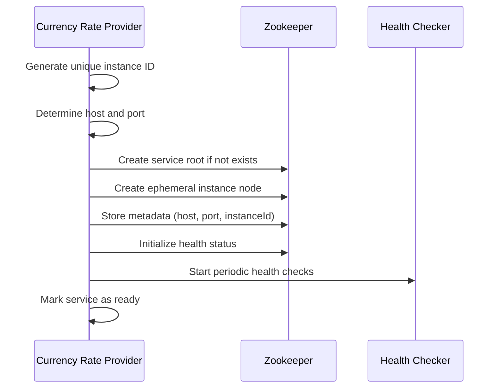
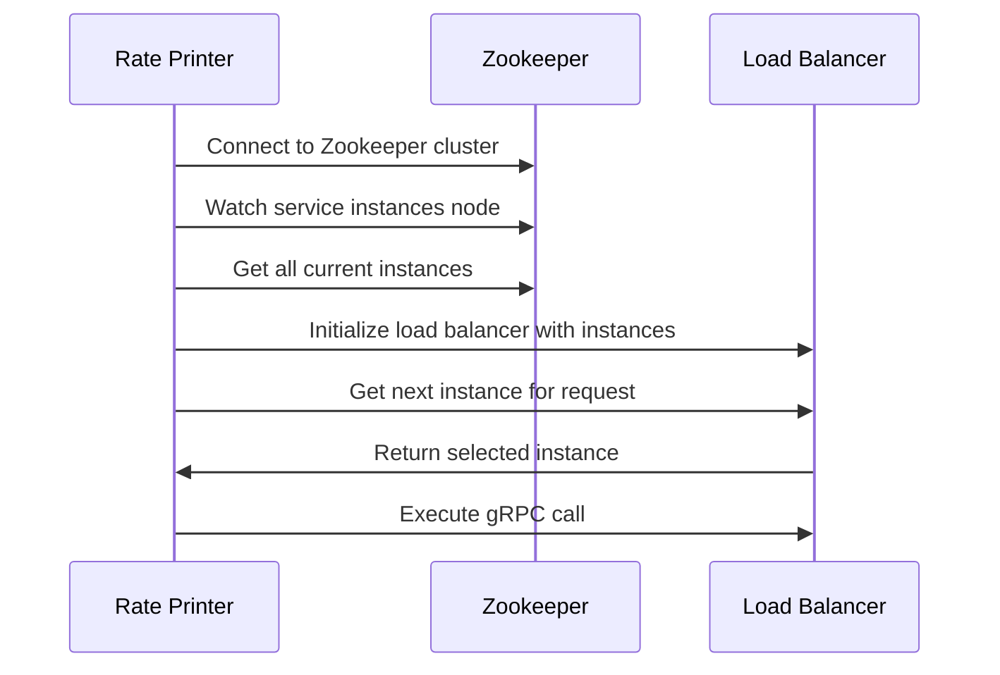

# Zookeeper Integration Architecture for Currency Rate Services

## Overview

This document outlines a comprehensive Zookeeper integration architecture for the currency rate provider/consumer project, transforming the current static configuration into a dynamic, scalable distributed system with automatic service discovery and load balancing.

## Current Architecture Analysis

### Existing Components
- **currency-rate-provider**: gRPC server on port 9090, hardcoded localhost configuration
- **rate-printer**: gRPC client with static `localhost:9090` configuration
- **Technology Stack**: Java 17, Spring Boot 3.2.0, gRPC 1.60.0

### Integration Points
1. **Producer Registration**: Replace static configuration with dynamic Zookeeper registration
2. **Consumer Discovery**: Replace hardcoded address with Zookeeper-based service discovery
3. **Load Balancing**: Implement round-robin distribution across multiple producer instances
4. **Configuration Management**: Externalize Zookeeper connection settings

## 1. Zookeeper Node Structure

### ZNode Hierarchy Design

```
/services
├── currency-rate-provider
│   ├── instances
│   │   ├── instance-001 (ephemeral)
│   │   │   ├── metadata
│   │   │   │   ├── host: "192.168.1.100"
│   │   │   │   ├── port: "9090"
│   │   │   │   ├── instanceId: "instance-001"
│   │   │   │   ├── status: "ACTIVE"
│   │   │   │   ├── startTime: "2026-02-15T12:45:00Z"
│   │   │   │   └── lastHeartbeat: "2026-02-15T12:50:00Z"
│   │   │   └── health
│   │   │       ├── status: "HEALTHY"
│   │   │       └── lastCheck: "2026-02-15T12:50:00Z"
│   │   ├── instance-002 (ephemeral)
│   │   └── instance-003 (ephemeral)
│   ├── config
│   │   ├── loadBalancingStrategy: "ROUND_ROBIN"
│   │   ├── healthCheckInterval: "30"
│   │   └── connectionTimeout: "5000"
│   └── locks
│       └── leader-election
```

### Node Types and Characteristics

1. **Persistent Nodes**:
   - `/services/currency-rate-provider` - Service root
   - `/services/currency-rate-provider/config` - Configuration
   - `/services/currency-rate-provider/locks` - Distributed locks

2. **Ephemeral Nodes**:
   - `/services/currency-rate-provider/instances/instance-{id}` - Auto-cleanup on disconnect
   - `/services/currency-rate-provider/instances/instance-{id}/metadata` - Instance metadata
   - `/services/currency-rate-provider/instances/instance-{id}/health` - Health status

3. **Sequential Nodes** (for leader election):
   - `/services/currency-rate-provider/locks/leader-election/lock-`

## 2. Service Registration Strategy

### Producer Registration Lifecycle

#### Startup Registration Process


#### Registration Data Structure
```json
{
  "instanceId": "instance-001",
  "host": "192.168.1.100",
  "port": 9090,
  "status": "ACTIVE",
  "startTime": "2026-02-15T12:45:00Z",
  "lastHeartbeat": "2026-02-15T12:50:00Z",
  "version": "1.0.0",
  "region": "us-west-1",
  "weight": 1
}
```

#### Health Check Mechanism
- **Heartbeat Interval**: 30 seconds
- **Timeout**: 10 seconds
- **Failure Threshold**: 3 consecutive failures
- **Recovery**: Automatic re-registration on recovery

#### Shutdown Process
1. Graceful shutdown signal received
2. Update status to "SHUTTING_DOWN"
3. Wait for in-flight requests to complete
4. Close Zookeeper session (auto-removes ephemeral nodes)
5. Shutdown application

## 3. Service Discovery Strategy

### Consumer Discovery Mechanism

#### Initial Discovery Process


#### Dynamic Update Handling
- **Watcher Registration**: Monitor `/services/currency-rate-provider/instances`
- **Event Types**: NodeChildrenChanged, NodeDeleted, NodeCreated
- **Update Strategy**: Rebuild instance list on changes
- **Failover**: Immediate retry with next available instance

#### Discovery Cache Strategy
- **Local Cache**: Maintain in-memory instance list
- **Cache TTL**: 60 seconds with background refresh
- **Stale Data Handling**: Fallback to cached data if Zookeeper unavailable
- **Cache Invalidation**: Immediate invalidation on Zookeeper events

## 4. Load Balancing Strategy

### Round-Robin Algorithm Implementation

#### Algorithm Design
```java
public class RoundRobinLoadBalancer {
    private final AtomicInteger currentIndex = new AtomicInteger(0);
    private volatile List<ServiceInstance> instances = new ArrayList<>();
    
    public ServiceInstance getNextInstance() {
        if (instances.isEmpty()) {
            throw new NoAvailableInstancesException();
        }
        
        int index = currentIndex.getAndIncrement() % instances.size();
        return instances.get(index);
    }
}
```

#### Load Balancing Features
1. **Round-Robin Distribution**: Sequential instance selection
2. **Instance Health Filtering**: Skip unhealthy instances
3. **Circuit Breaker**: Temporarily exclude failing instances
4. **Weight Support**: Future extension for weighted round-robin

#### Failover Handling
- **Primary Failure**: Immediate retry with next instance
- **All Instances Failed**: Exponential backoff with jitter
- **Recovery**: Gradual re-introduction of recovered instances
- **Timeout Handling**: Configurable request timeouts per instance

## 5. Technical Implementation Plan

### Required Dependencies

#### Apache Curator Framework
```xml
<dependency>
    <groupId>org.apache.curator</groupId>
    <artifactId>curator-framework</artifactId>
    <version>5.6.0</version>
</dependency>
<dependency>
    <groupId>org.apache.curator</groupId>
    <artifactId>curator-recipes</artifactId>
    <version>5.6.0</version>
</dependency>
<dependency>
    <groupId>org.apache.curator</groupId>
    <artifactId>curator-x-discovery</artifactId>
    <version>5.6.0</version>
</dependency>
```

#### Additional Dependencies
```xml
<dependency>
    <groupId>org.apache.zookeeper</groupId>
    <artifactId>zookeeper</artifactId>
    <version>3.8.3</version>
</dependency>
```

### New Java Components

#### Currency Rate Provider (Producer)
1. **ServiceRegistry**: Handles Zookeeper registration and lifecycle
2. **HealthCheckService**: Periodic health monitoring
3. **InstanceMetadata**: Instance information management
4. **ZookeeperConfiguration**: Connection and configuration management

#### Rate Printer (Consumer)
1. **ServiceDiscovery**: Dynamic service discovery and watching
2. **LoadBalancer**: Round-robin load balancing implementation
3. **DynamicGrpcClient**: gRPC client with dynamic endpoint resolution
4. **CircuitBreaker**: Failure handling and recovery

### Configuration Changes

#### Producer Configuration (application.properties)
```properties
# Zookeeper Configuration
zookeeper.connection-string=localhost:2181,localhost:2182,localhost:2183
zookeeper.session-timeout=30000
zookeeper.connection-timeout=15000
zookeeper.retry.max-attempts=3
zookeeper.retry.base-sleep-time=1000

# Service Registration
service.registry.path=/services/currency-rate-provider
service.instance.id=${spring.application.name}-${random.uuid}
service.health.check.interval=30000
service.health.check.timeout=10000

# gRPC Server (unchanged)
grpc.server.port=${server.port:9090}
```

#### Consumer Configuration (application.yml)
```yaml
# Zookeeper Configuration
zookeeper:
  connection-string: localhost:2181,localhost:2182,localhost:2183
  session-timeout: 30000
  connection-timeout: 15000
  retry:
    max-attempts: 3
    base-sleep-time: 1000

# Service Discovery
service:
  discovery:
    path: /services/currency-rate-provider
    refresh-interval: 60000
    cache-ttl: 60000
  load-balancer:
    strategy: ROUND_ROBIN
    timeout: 5000
    retry-attempts: 3

# gRPC Client (dynamic)
grpc:
  client:
    currency-rate-service:
      negotiationType: plaintext
      enableKeepAlive: true
      keepAliveTime: 30s
      keepAliveTimeout: 10s
```

### Spring Boot Integration

#### Producer Lifecycle Integration
```java
@Component
public class ServiceRegistryLifecycle implements ApplicationListener<ApplicationReadyEvent>, DisposableBean {
    
    @EventListener
    public void onApplicationReady(ApplicationReadyEvent event) {
        // Register service after application startup
        serviceRegistry.register();
    }
    
    @Override
    public void destroy() {
        // Unregister on shutdown
        serviceRegistry.unregister();
    }
}
```

#### Consumer Integration
```java
@Component
public class DynamicGrpcClientManager implements ApplicationListener<ApplicationReadyEvent> {
    
    @EventListener
    public void onApplicationReady(ApplicationReadyEvent event) {
        // Initialize service discovery and load balancer
        serviceDiscovery.initialize();
        loadBalancer.refreshInstances(serviceDiscovery.getInstances());
    }
}
```

## 6. Error Handling & Resilience

### Connection Loss Handling

#### Zookeeper Connection Resilience
```java
public class ResilientZookeeperConnection {
    private final CuratorFramework client;
    private final ConnectionStateListener connectionListener;
    
    @PostConstruct
    public void initialize() {
        client.getConnectionStateListenable().addListener((client, newState) -> {
            switch (newState) {
                case RECONNECTED:
                    // Re-register service, refresh discovery
                    handleReconnection();
                    break;
                case SUSPENDED:
                    // Use cached data, log warning
                    handleSuspension();
                    break;
                case LOST:
                    // Full reconnection required
                    handleConnectionLoss();
                    break;
            }
        });
    }
}
```

### No Available Producers Scenario

#### Fallback Strategies
1. **Cached Data**: Use last known good instances
2. **Exponential Backoff**: Retry with increasing delays
3. **Circuit Breaker**: Temporarily stop trying after repeated failures
4. **Alternative Endpoints**: Fallback to static configuration if available

#### Implementation Example
```java
public class ResilientServiceCaller {
    private final CircuitBreaker circuitBreaker;
    private final RetryTemplate retryTemplate;
    
    public GetRateResponse callWithResilience() {
        return retryTemplate.execute(context -> {
            return circuitBreaker.executeSupplier(() -> {
                ServiceInstance instance = loadBalancer.getNextInstance();
                return callService(instance);
            });
        });
    }
}
```

### Producer Failure During Request

#### Request-Level Resilience
1. **Request Timeout**: Configurable per-request timeout
2. **Instance Marking**: Mark failing instances as unhealthy
3. **Immediate Retry**: Retry with different instance
4. **Request Idempotency**: Ensure safe retries

## 7. Testing Strategy

### Multi-Instance Testing

#### Test Environment Setup
```yaml
# docker-compose.yml for testing
version: '3.8'
services:
  zookeeper:
    image: confluentinc/cp-zookeeper:7.4.0
    environment:
      ZOOKEEPER_CLIENT_PORT: 2181
      ZOOKEEPER_TICK_TIME: 2000
    ports:
      - "2181:2181"
  
  currency-rate-provider-1:
    build: ./currency-rate-provider
    environment:
      SERVER_PORT: 9090
      SERVICE_INSTANCE_ID: provider-1
    ports:
      - "9090:9090"
  
  currency-rate-provider-2:
    build: ./currency-rate-provider
    environment:
      SERVER_PORT: 9091
      SERVICE_INSTANCE_ID: provider-2
    ports:
      - "9091:9091"
  
  currency-rate-provider-3:
    build: ./currency-rate-provider
    environment:
      SERVER_PORT: 9092
      SERVICE_INSTANCE_ID: provider-3
    ports:
      - "9092:9092"
  
  rate-printer:
    build: ./rate-printer
    depends_on:
      - zookeeper
      - currency-rate-provider-1
      - currency-rate-provider-2
      - currency-rate-provider-3
```

#### Load Balancing Verification Tests
```java
@Test
public void testRoundRobinLoadBalancing() {
    // Start 3 producer instances
    startProducers(3);
    
    // Make 10 requests
    List<ServiceInstance> usedInstances = new ArrayList<>();
    for (int i = 0; i < 10; i++) {
        ServiceInstance instance = loadBalancer.getNextInstance();
        usedInstances.add(instance);
    }
    
    // Verify round-robin distribution
    assertThat(usedInstances).containsExactly(
        instance1, instance2, instance3, instance1, instance2,
        instance3, instance1, instance2, instance3, instance1
    );
}
```

### Failure Scenario Testing

#### Test Cases
1. **Producer Crash**: Simulate producer failure during operation
2. **Network Partition**: Test behavior during network issues
3. **Zookeeper Failure**: Test resilience to Zookeeper unavailability
4. **Slow Producer**: Test timeout handling with slow instances
5. **Rapid Scaling**: Test adding/removing instances dynamically

#### Chaos Engineering Tests
```java
@Test
public void testProducerFailureResilience() {
    // Start with 3 producers
    startProducers(3);
    
    // Verify all instances are discovered
    assertThat(serviceDiscovery.getInstances()).hasSize(3);
    
    // Kill one producer
    killProducer(2);
    
    // Verify instance is removed from discovery
    await().atMost(30, SECONDS).until(() -> 
        serviceDiscovery.getInstances().size() == 2
    );
    
    // Verify requests continue with remaining instances
    assertDoesNotThrow(() -> {
        for (int i = 0; i < 10; i++) {
            ratePrinterService.printCurrentRate();
        }
    });
}
```

### Performance Testing

#### Metrics to Monitor
1. **Discovery Latency**: Time to detect instance changes
2. **Load Balancing Overhead**: Additional latency from load balancing
3. **Throughput**: Requests per second with multiple instances
4. **Resource Usage**: Memory and CPU overhead of Zookeeper integration
5. **Failure Recovery Time**: Time to recover from failures

## 8. Monitoring and Observability

### Key Metrics
1. **Service Registration**: Registration success/failure rates
2. **Service Discovery**: Discovery latency and success rates
3. **Load Balancing**: Request distribution per instance
4. **Health Checks**: Health check pass/fail rates
5. **Connection Status**: Zookeeper connection state changes

### Logging Strategy
```java
@Component
public class ZookeeperMetricsLogger {
    private final MeterRegistry meterRegistry;
    
    public void logServiceRegistration(String instanceId, boolean success) {
        Counter.builder("service.registration")
            .tag("instance", instanceId)
            .tag("status", success ? "success" : "failure")
            .register(meterRegistry)
            .increment();
    }
    
    public void logLoadBalancingDecision(String instanceId) {
        Counter.builder("load.balancing.decision")
            .tag("selected_instance", instanceId)
            .register(meterRegistry)
            .increment();
    }
}
```

## 9. Security Considerations

### Zookeeper Security
1. **Authentication**: SASL authentication for Zookeeper connections
2. **Authorization**: ACL-based access control to ZNodes
3. **Encryption**: TLS encryption for Zookeeper communication
4. **Network Security**: Firewall rules for Zookeeper ports

### Service Security
1. **Instance Validation**: Validate instance metadata before registration
2. **Access Control**: Restrict who can register/discover services
3. **Data Privacy**: Sensitive data encryption in ZNodes
4. **Audit Logging**: Log all service registration/discovery activities

## 10. Deployment Considerations

### Production Deployment
1. **Zookeeper Cluster**: Minimum 3-node ensemble for high availability
2. **Network Configuration**: Proper DNS resolution and network connectivity
3. **Resource Allocation**: Sufficient memory and CPU for Zookeeper
4. **Backup Strategy**: Regular Zookeeper data backups
5. **Monitoring**: Comprehensive monitoring of all components

### Configuration Management
1. **Environment-Specific Configs**: Different settings for dev/staging/prod
2. **Secret Management**: Secure storage of connection strings and credentials
3. **Configuration Validation**: Validate configuration on startup
4. **Dynamic Updates**: Support for runtime configuration changes

## 11. Migration Strategy

### Phased Rollout
1. **Phase 1**: Deploy Zookeeper cluster and basic integration
2. **Phase 2**: Enable service registration for producers
3. **Phase 3**: Enable service discovery for consumers
4. **Phase 4**: Add load balancing and advanced features
5. **Phase 5**: Optimize performance and add monitoring

### Backward Compatibility
1. **Fallback Mode**: Support for static configuration during transition
2. **Feature Flags**: Enable/disable Zookeeper integration dynamically
3. **Gradual Migration**: Migrate instances one by one
4. **Rollback Plan**: Quick rollback to static configuration if needed

## 12. Conclusion

This Zookeeper integration architecture provides a robust, scalable solution for transforming the currency rate services from static configuration to dynamic service discovery. The design ensures:

- **High Availability**: Multiple producer instances with automatic failover
- **Scalability**: Easy addition/removal of service instances
- **Resilience**: Comprehensive error handling and recovery mechanisms
- **Observability**: Full monitoring and logging capabilities
- **Maintainability**: Clean separation of concerns and modular design

The architecture follows distributed systems best practices and provides a solid foundation for future enhancements and scaling requirements.